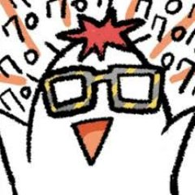

|  |*"I am always keen to keep my surroundings clean and organized. But why am I doing this? After a short while it's a mess again. I think my brain - that little rascal - is loving it to adjust the level of chaos of its surroundings to it\'s own chaotic internal landscape."*|
|--|--|

<!--Languages: [][link][link](ACTUAL_LINK)
-->

| |  | |
| -| - |- |
| | | |

Even though many facts may argue against it I first want to clarify here that **I am not a nerd**. I take this ⬆️ as a proof.[^1] You could rather consider me as a very, very, very inspired snowflake ❄️.

I want my GitHub to represent my interest in game development, computational arts and ... apparently [BTS](https://github.com/sereneWarrior/D3-BTS-Word-Distributions)❤️.

-------------
## Kinds of projects I would like to work on one day (..but probably my life won't be long enough to do so):

- Awesome, epic, history themed adventure game
- Painting or 3D graphic application
- Crowd AI in games
- Emotional AI for mental health care applications
- Digitalizing the human soul/ mind / consciousness
- Translating this readme into korean and japanese ...

------------------
## Technology/ applications/ projects I feel most inspired by:

- Vocaloid (Voice Synthesizer Software)
- Procreate
- Blender
- Pause (mindfilness application)
- [Fairy lights in Femtoseconds](https://digitalnature.slis.tsukuba.ac.jp/vision-en/) - tangible holograms (and holograms in general)
- [Dancer to piano performance system](https://www.yamaha.com/en/news_release/2018/18013101/) (Yamaha project)

-------------------------
[^1]: I don't concider 'nerd' as a negative term and don't intent to offend anyone who counts himself as such. 